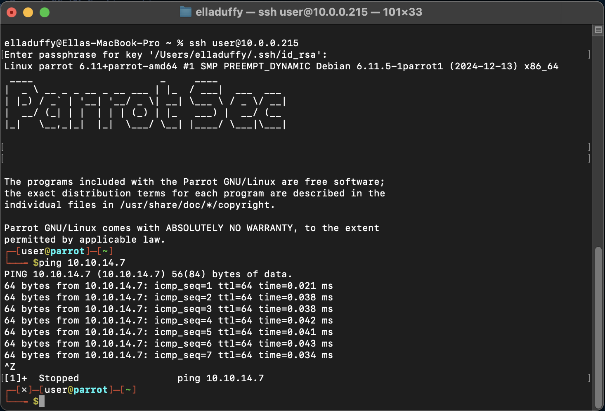

# Hack The Box AI Pentesting Agent

This project builds an AI-powered pentesting assistant for Hack The Box Acadmey challenges, using a Parrot OS VM, Dockerized Open WebUI, and a custom SSH command execution tool. The agent executes commands (e.g., `whoami`, `ifconfig`) on a remote VM via a clean chat interface, logging details separately, and supports my Penetration Tester path with enhanced performance using OpenAI’s `gpt-4o-mini`.

## Project Overview
- **Goal**: Create a user-friendly AI agent to run pentesting commands on a Hack The Box VM, delivering raw outputs (e.g., `user` for `whoami`) while logging debug info (e.g., SSH connections) to a file.
- **Tech Stack**:
    - **Parrot OS VM**: Runs at `10.0.0.215` for command execution.
    - **Docker**: Hosts Open WebUI (`ghcr.io/open-webui/open-webui:main`) with mounted tools, SSH key, and logs.
    - **Open WebUI**: Provides a chat interface with `gpt-4o-mini` (via OpenAI API) for tool-calling, upgraded from `llama3-groq-tool-use:8b` for speed.
    - **Python**: Powers `ssh_command_executor.py` (version 1.0.3) using `paramiko` for SSH.
    - **Ollama**: Previously served `llama3` at `http://host.docker.internal:11434`.
- **Status**: Successfully executes commands, handles errors (e.g., `bash: fakecommand: command not found`), and delivers fast, clean chat outputs.

## Setup Steps
### 1. Parrot OS VM Configuration
- **Installation**: 
  - [Install Parrot OS Hack The Box edition on VirtualBox](https://help.hackthebox.com/en/articles/6369713-installing-parrot-security-on-a-vm) with the following settings:
      - Type: Linux, Debian (64-bit).
      - Memory: 4GB (minimum 2GB).
      - Storage: 20GB dynamic disk.
      - Network: Bridged Adapter (to allow SSH access from your host machine to the VM’s HTB-assigned IP).
  - After setup, checked the VM’s username with `whoami` (e.g., `user`) and IP address using `ifconfig` (e.g., my VM was assigned `10.0.0.215` by the network).
```bash
ifconfig
# Example output:
eth0: flags=4163<UP,BROADCAST,RUNNING,MULTICAST>  mtu 1500
      inet 10.0.0.215  netmask 255.255.255.0  broadcast 10.0.0.255
# Note your VM’s IP (e.g., inet address) for SSH configuration.
```
_Note:_ Your VM’s IP will depend on your network settings (e.g., DHCP). Use the IP shown by `ifconfig` in place of 10.0.0.215 for all initial SSH commands and tool configurations (before we start interacting with HTB network).

- **Connect to Hack The Box VPN**: 
  - **Purpose**: Connect the VM to the HTB network to assign it an HTB IP (e.g., `10.10.14.7`) for challenge access.
  - **Steps**:
    1. Sign up for an HTB account at `hackthebox.com`.
    2. In the VM, download your OpenVPN configuration file (e.g., `academy-regular.ovpn`) from `https://academy.hackthebox.com/vpn` using a browser (e.g., Firefox in Parrot OS).
    3. Install OpenVPN in the VM:
    ```bash
    sudo apt update
    sudo apt install openvpn
    ```
    4. Start the OpenVPN Server:
    ```bash
    sudo systemctl start openvpn
    sudo systemctl status openvpn
    ```
    5. Connect to the HTB VPN:
    ```bash
    sudo openvpn ~/academy-regular.ovpn
    ```
    6. Verify the connection:
    ```bash
    ip addr show tun0
    # Expect a tun0 interface with an IP (e.g., 10.10.10.x)
    ```
    _Note_: Keep the VPN running in the VM to maintain HTB network access.

- **SSH Server**: 
    - Install and enable `openssh-server`:
    ```bash
    sudo apt install openssh-server
    sudo systemctl enable ssh --now
    sudo systemctl status ssh
    ```
    - Configure Key-Based Authentication between VM and host machine:
        1. Generate a SSH Key Pair on host machine: `ssh-keygen -t rsa`
        _Note_: Take note of the passphrase you entered.
        2. Ensured ~/.ssh/id_rsa has correct permissions: `chmod 600 ~/.ssh/id_rsa`
        3. Copy the Public Key to the VM: `ssh-copy-id -i ~/.ssh/id_rsa.pub user@<your-vm-ip>`
        4. Configure the VM to Allow Key-Based Authentication:
            - On the VM, edit the SSH configuration file: `sudo nano /etc/ssh/sshd_config`
            - Find the line that says **PasswordAuthentication** and change its value to no.
             - Save the file and restart the SSH service: `sudo systemctl restart ssh`

- **Verification**: 
    - Tested SSH from the host:
    ```bash
    ssh user@<your-vm-ip>
    ```
    - Confirmed VPN connectivity:
    ```bash
    ping 10.10.14.7  # HTB network IP
    ```

*Screenshot: Parrot OS VM configuration validation.*

### 2. Docker and Open WebUI Setup
- **Prerequisites**: Installed Docker Desktop (docker.com) on your host machine, and ensure Docker is running:
  ```bash
  docker --version
  # Expect: Docker version 20.x or higher
  ```
- **Docker Container**: Launch the Open WebUI container using the following command, which configures networking, mounts directories, and loads environment variables:
  ```bash
  docker run -d \
  -p 3000:8080 \
  -v ~/Ella_AI/HTB:/app/backend/tools \
  -v ~/.ssh/id_rsa:/app/tools/id_rsa:ro \
  -v ~/Ella_AI/logs:/app/logs \
  --env-file ~/Ella_AI/.env \
  --name open-webui \
  ghcr.io/open-webui/open-webui:main
  ```
  **Command Breakdown**:
  - `-d`: Runs the container in detached mode, allowing it to operate in the background without occupying your terminal.
  - `-p 3000:8080`: Maps port `3000` on your host machine to port `8080` inside the container, enabling access to Open WebUI at `http://localhost:3000`. Port `8080` is the default for Open WebUI’s web interface.
  - `-v ~/Ella_AI/HTB:/app/backend/tools`: Mounts the `~/Ella_AI/HTB directory` (contains my tool `ssh_command_executor.py`) from your host to `/app/backend/tools` in the container, making the Python script available as a tool for Open WebUI.
  - `-v ~/.ssh/id_rsa:/app/tools/id_rsa:ro`: Mounts your SSH private key (`~/.ssh/id_rsa`) to `/app/tools/id_rsa` in the container in **read-only** mode (`:ro`), allowing `ssh_command_executor.py` to use it for SSH authentication to the VM (e.g., `10.0.0.215`).
  - `-v ~/Ella_AI/logs:/app/logs`: Mounts the `~/Ella_AI/logs` directory to `/app/logs` in the container, storing logs (e.g., `ssh_executor.log`) from `ssh_command_executor.py` on your host for debugging.
  - `--env-file ~/Ella_AI/.env`: Loads environment variables from `~/Ella_AI/.env` (e.g., `SSH_PASSPHRASE`, `OPENAI_API_KEY`) into the container, securely passing sensitive data without hardcoding.
  - `--name open-webui`: Assigns the name `open-webui` to the container for easy management (e.g., `docker stop open-webui`).
  - `ghcr.io/open-webui/open-webui:main`: Specifies the Docker image from GitHub Container Registry, using the `main` tag for the latest stable Open WebUI version.
- **.env File**: Create ~/Ella_AI/.env with the following content:
  ```plain
  SSH_PASSPHRASE=<your-passphrase>
  OLLAMA_BASE_URL=http://host.docker.internal:11434
  OPENAI_API_KEY=sk-xxx
  ```
  _Note_: Replace `<your-passphrase>` with your SSH key passphrase and `sk-xxx` with your OpenAI API key from `platform.openai.com`. Ensure .env is excluded from version control via .gitignore.
- **Verification**:
    - Check container status:
      ```bash
      docker ps
      # Expect: Container named 'open-webui' with ports 0.0.0.0:3000->8080/tcp
      ```
    - Confirm mounted files:
      ```bash
      docker exec open-webui ls /app/backend/tools/ssh_command_executor.py
      docker exec open-webui ls /app/tools/id_rsa
      ```
    - Access Open WebUI at `http://localhost:3000` in a browser.
    - Verify logs directory:
      ```bash
      ls ~/Ella_AI/logs
      # Expect: ssh_executor.log (created after first command execution)
      ```
  _Note_: If the container fails to start, check Docker logs:
  ```bash
  docker logs open-webui
  ```

### 3. SSH Command Executor Tool
- **Implementation**: Created `ssh_command_executor.py` to execute commands on the VM using `paramiko` for secure SSH connections, logging all actions to `/app/logs/ssh_executor.log`. The script handles stdout and stderr for accurate command outputs (e.g., `bash: fakecommand: command not found`) and prepends PATH for commands like `ifconfig` to ensure accessibility. See the full code in ssh_command_executor.py.

### 4. Open WebUI Integration
- **Tool Setup**: Added the `ssh_execute_command tool` in Open WebUI using the web interface:
    1. Navigated to `http://localhost:3000` > Workspace > Tools.
    2. Clicked the `+` button to create a new tool.
    3. Filled in the tool details:
        - **Tool Name**: `SSH Command Executor`
        - **Tool ID**: `ssh_command_executor`
        - **Tool Description**: `Executes commands on my remote HTB Parrot OS VM and returns the output, with logging.`
    4. Pasted the contents of `ssh_command_executor.py` directly into the tool’s code editor.
    5. Saved the tool. 

*Screenshot: Open WebUI Tools page showing the setup of the SSH Command Executor tool.*

- **Model Setup**: Configured the AI model in Open WebUI to work with the tool:
    1. Navigated to `http://localhost:3000` > Workspace > Models.
    2. Created a new model named `HTB AI`.
    3. Selected `gpt-4o-mini` (OpenAI API) as the model, using the API key added to .env:
    4. Set the system prompt in the model’s settings:
    ```
    You are an AI assistant for Hack The Box pentesting. When asked to run a command on the HTB VM, use the ssh_execute_command tool   with host='<your-vm-ip>' and username='user'. Return only the exact output of the command, with no additional text, variable names, or logs. For example, if the command is 'whoami', return only 'user'.
    ```
    5. Saved the model as the default for the workspace. _Note_: Upgraded from `llama3-groq-tool-use:8b` (via Ollama) due to slow responses (~5s). `gpt-4o-mini` provides faster responses (<1s), critical for HTB challenges. 

*Screenshot: Open WebUI settings with gpt-4o-mini selected for the HTB AI model.*

- **Testing**:
    - Prompt: “Run ‘whoami’ on my HTB VM.” → Output: `user`
    - Prompt: “Run ‘fakecommand’ on my HTB VM.” → Output: `bash: fakecommand: command not found`
    - Verified logs:
    ```bash
    cat ~/Ella_AI/logs/ssh_executor.log
    # Example:
    2025-04-26 09:00:01 - INFO - Executing command: PATH=$PATH:/sbin:/usr/sbin whoami
    2025-04-26 09:00:01 - INFO - Command output: user
    ```

*Screenshot: Chat output for our HTB AI model created in Open WebUI*

## Achievements
- Clean Interface: Chat delivers only command outputs, with logs in ~/Ella_AI/logs/ssh_executor.log.
- Robust Error Handling: Captures stderr for diagnostics (e.g., bash: fakecommand: command not found).
- Performance: gpt-4o-mini ensures rapid responses, critical for HTB challenges.
- HTB Relevance: Supports enumeration (e.g., netstat -tuln, ifconfig) for pentesting.

## Next Steps
- Integrate Hugging Face Transformers for adversarial prompt testing.
- Implement LangChain for multi-step pentesting workflows (e.g., scan → enumerate).
